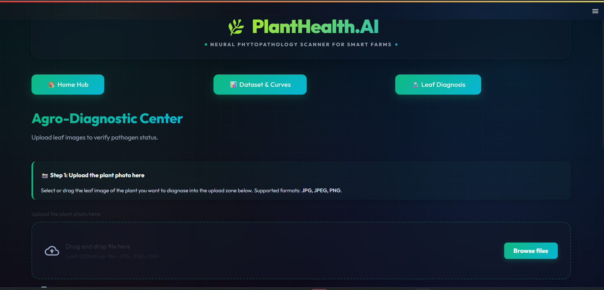
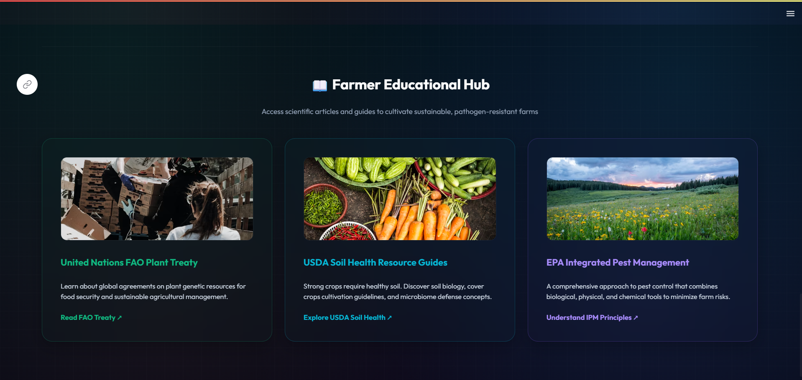
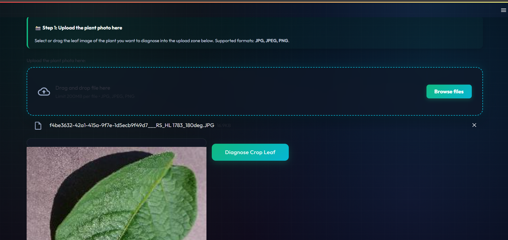
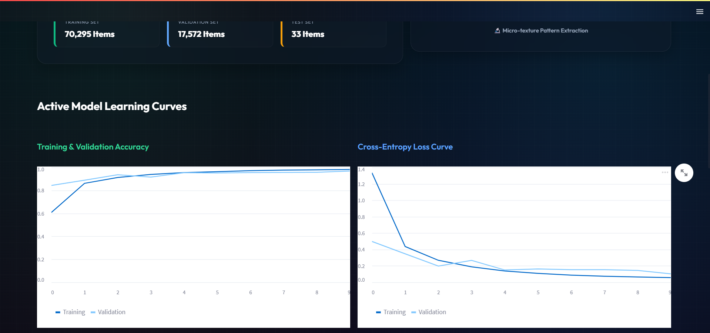
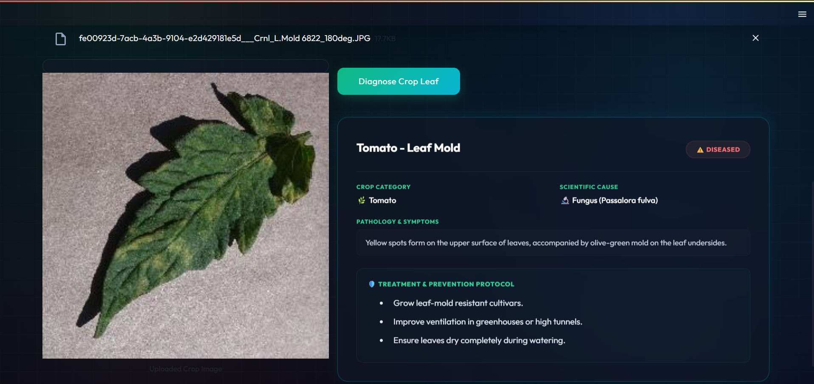

# 🌿 PlantHealth — Dr. Plant

A desktop application that detects tomato plant diseases from leaf images using a custom-trained CNN, and provides actionable treatment remedies for each detected condition.

---

## 📌 Overview

**Dr. Plant** is a Tkinter-based desktop app where users upload a leaf image, and the app classifies it into one of 4 categories using a trained Convolutional Neural Network. If a disease is detected, the app displays the disease name and offers specific remedies at the click of a button.

---

## ✨ Features

- 🖼️ Upload a leaf image via file dialog for instant analysis
- 🧠 5-layer CNN classifies the leaf into one of 4 health categories
- 🌿 Detects **Healthy**, **Bacterial Spot**, **Yellow Leaf Curl Virus**, and **Late Blight**
- 💊 Displays disease-specific **remedies** for each detected condition
- 📊 Uses **OpenCV** for image preprocessing and resizing
- 🖥️ Clean desktop UI built with **Tkinter**

---
## 📸 App Walkthrough & Screenshots

Here is a visual guide to how **Dr. Plant** operates, from the initial dashboard to the final diagnosis.

### 1. User Interface & Dashboards
The application features a clean, intuitive desktop interface designed for both farmers and researchers.

| Home Page | Farmer Education Hub |
| :---: | :---: |
|  |  |

---

### 2. Diagnosis Pipeline
Users can upload a high-resolution image of a leaf. The app instantly processes it through the 5-layer CNN model.

| Step 1: Photo Uploading | Step 2: Leaf Diagnosis |
| :---: | :---: |
|  |  |

---

### 3. Model Accuracy & Testing
The system provides transparency by allowing users to view the underlying training curves and real-time test results.

| Dataset & Learning Curves | Sample Test Result |
| :---: | :---: |
|  |  |

---

## 🗂️ Dataset

- **Source**: Kaggle — Plant Disease Image Dataset
- **Structure**: `train/train/` and `test/test/` folders with labeled images
- **Image size**: Resized to 50×50 pixels for model input
- **Labels** (determined by first letter of filename):
  - `h` → Healthy
  - `b` → Bacterial Spot
  - `v` → Yellow Leaf Curl Virus
  - `l` → Late Blight

---

## 🧠 Model Architecture

Built using **TFLearn** on top of **TensorFlow**:

| Layer | Details |
|---|---|
| Input | 50 × 50 × 3 (RGB) |
| Conv2D + MaxPool | 32 filters, 3×3, ReLU |
| Conv2D + MaxPool | 64 filters, 3×3, ReLU |
| Conv2D + MaxPool | 128 filters, 3×3, ReLU |
| Conv2D + MaxPool | 32 filters, 3×3, ReLU |
| Conv2D + MaxPool | 64 filters, 3×3, ReLU |
| Fully Connected | 1024 units, ReLU |
| Dropout | 0.8 keep rate |
| Output | 4 units, Softmax |

- **Optimizer**: Adam
- **Loss**: Categorical Crossentropy
- **Learning rate**: 1e-3
- **Epochs**: 8

---

## 🛠️ Tech Stack

| Component | Technology |
|---|---|
| Desktop UI | Tkinter |
| Model Training | TFLearn + TensorFlow |
| Image Processing | OpenCV, NumPy |
| Visualization | Matplotlib |
| Language | Python |

---

## 🚀 Getting Started

### 1. Clone the repository

```bash
git clone https://github.com/SravikaPadakanti/PlantHealth.git
cd PlantHealth
```

### 2. Install dependencies

```bash
pip install tensorflow tflearn opencv-python numpy tqdm matplotlib pillow
```

### 3. Train the model

```bash
python cnn.py
```

This reads images from `train/train/`, trains the CNN for 8 epochs, and saves the model as `healthyvsunhealthy-0.001-2conv-basic.model`.

### 4. Run the app

```bash
python ui.py
```

---

## 📸 How to Use

1. Launch the app — the **Dr. Plant** window opens
2. Click **Get Photo** to select a leaf image (`.jpg`)
3. Click **Analyse Image** — the model predicts the condition
4. If a disease is found, click **Remedies** for treatment steps

---

## 🦠 Detected Diseases & Remedies

| Disease | Remedy Highlights |
|---|---|
| **Bacterial Spot** | Destroy affected plants, rotate crops yearly, use copper fungicides |
| **Yellow Leaf Curl Virus** | Handpick diseased plants, use yellow sticky traps, spray insecticides |
| **Late Blight** | Remove infected leaves, treat with copper spray, apply chlorothalonil fungicide |
| **Healthy** | No action needed — plant is healthy! |

---

## 📁 Project Structure

```
PlantHealth/
├── cnn.py              # CNN model training script
├── ui.py               # Tkinter desktop application
├── train/train/        # Training images (from Kaggle)
├── test/test/          # Test images
├── testpicture/        # Temp folder for image under analysis
└── README.md
```

---

## 🙋‍♀️ Author

**Sravika Padakanti**  
[GitHub](https://github.com/SravikaPadakanti) · [LinkedIn](https://linkedin.com/in/Sravika-Padakanti/)
